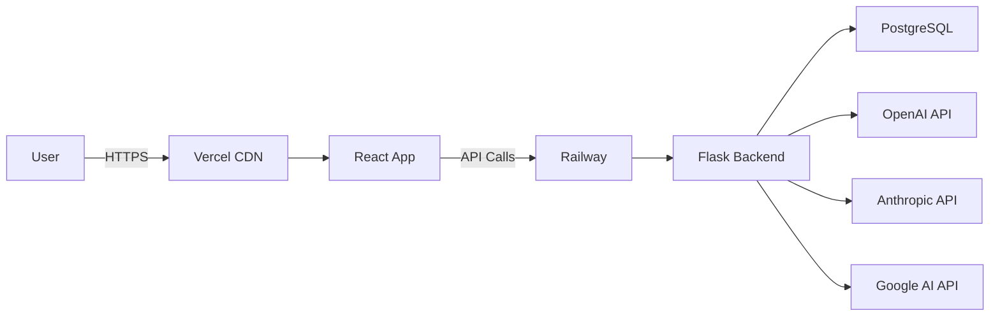

# 🎯 Legal Pro Hub - Sistema Jurídico Inteligente

> **Plataforma SaaS completa para gestão jurídica com IA Multi-Agente**

[](https://github.com/arsdatascience/Legal-Pro-V2)
[](https://legal-pro-saas.up.railway.app)
[](https://hub-legal-pro.vercel.app)
[](https://railway.app)
[](https://hub-legal-pro.vercel.app)

---

## 📋 Índice

- [Visão Geral](#visão-geral)
- [Funcionalidades Implementadas](#funcionalidades-implementadas)
- [Arquitetura](#arquitetura)
- [Assistentes Jurídicos](#assistentes-jurídicos)
- [Chat Avançado](#chat-avançado)
- [Tecnologias](#tecnologias)
- [Deploy](#deploy)
- [Roadmap 2025](#roadmap-2025)
- [Contribuição](#contribuição)

---

## 🚀 Visão Geral

**Legal Pro Hub** é uma plataforma SaaS de próxima geração que combina **Inteligência Artificial Multi-Agente**, **Gestão de Processos**, **Analytics Avançado** e **Automação Jurídica** em um único sistema integrado.

### ✨ Diferenciais

- 🤖 **395 Assistentes Especializados** em todas as áreas do Direito
- 🧠 **IA Multi-Provider** (OpenAI GPT-5, Anthropic Claude 4.5, Google Gemini 3)
- 💬 **Chat Avançado** com histórico persistente e upload de documentos
- 📊 **Analytics em Tempo Real** com dashboards interativos
- ⚖️ **Módulo CPFL** especializado em Setor Energia
- 🔄 **Multi-Agente** com orquestração inteligente
- 🌐 **API REST** completa para integrações

---

## ✅ Funcionalidades Implementadas

### 🤖 **Sistema de Assistentes Jurídicos** (100%)

#### **Core**
- ✅ 395 assistentes pré-configurados
- ✅ 40+ áreas jurídicas cobertas
- ✅ Modelos LLM atualizados (Dezembro 2025)
- ✅ Customização de assistentes
- ✅ Sistema de prompts dinâmicos
- ✅ Configurações LLM por assistente

#### **Categorias de Assistentes**
| Categoria | Quantidade | Exemplos |
|-----------|------------|----------|
| Direito Civil | 45 | Contratos, Família, Sucessões |
| Direito Penal | 38 | Criminal, Execução, Júri |
| Direito Trabalhista | 32 | CLT, Sindicatos, Previdenciário |
| Direito Empresarial | 28 | Societário, Compliance, M&A |
| Direito Tributário | 25 | ICMS, ISS, IRPJ |
| Direito Bancário | 22 | Contratos, Compliance, Inadimplência |
| Direito do Consumidor | 20 | CDC, Restituição, Recall |
| Setor Energia | 18 | CPFL, Regulatório, Tarifas |
| Direito Digital | 15 | LGPD, E-commerce, Cibercrimes |
| Outros | 152 | Ambiental, Saúde, Imobiliário, etc. |

---

### 💬 **Chat Avançado com IA** (95%)

#### **Funcionalidades de Chat**
- ✅ **Interface em 3 colunas** (Lista → Histórico → Chat)
- ✅ **Seleção de Provider** (OpenAI, Anthropic, Google)
- ✅ **Seleção de Modelo** (9 modelos disponíveis)
- ✅ **Histórico de Conversas** persistente
- ✅ **Upload de Arquivos** (drag-and-drop)
- ✅ **Auto-scroll** de mensagens
- ✅ **Loading states** e feedback visual
- ✅ **Criação de novas conversas**
- ✅ **Exclusão de conversas** (soft delete)
- ⏳ **Resumo automático** de conversas (pendente)
- ⏳ **Compartilhamento** de conversas (pendente)

#### **Modelos LLM Disponíveis** (Dez 2025)

**OpenAI**:
- `gpt-5.2-thinking` - Reasoning avançado
- `gpt-5.2-instant` - Resposta rápida
- `gpt-5.2-pro` - Máxima precisão
- `gpt-5.1` - Versão anterior estável

**Anthropic**:
- `claude-sonnet-4.5` - Balanceado (padrão)
- `claude-opus-4.5` - Performance máxima
- `claude-haiku-4.5` - Rápido e econômico

**Google**:
- `gemini-3-pro-preview` - Última geração
- `gemini-2.5-pro` - Produção estável
- `gemini-2.5-flash` - Ultra rápido

#### **Upload de Arquivos**
Formatos suportados:
- 📄 Documentos: PDF, DOC, DOCX, TXT
- 📊 Planilhas: XLSX, CSV
- 🖼️ Imagens: PNG, JPG, JPEG, GIF
- 📦 Outros: ZIP

**Limite**: 16MB por arquivo

---

### 📊 **Gestão de Processos** (85%)

#### **Funcionalidades**
- ✅ CRUD completo de processos
- ✅ Acompanhamento de andamentos
- ✅ Sistema de prazos e alertas
- ✅ Vinculação com clientes
- ✅ Documentos anexados
- ✅ Histórico de movimentações
- ✅ Filtros e buscas avançadas
- ✅ Relatórios estatísticos
- ⏳ Integração com tribunais (JUDIT)
- ⏳ OCR de documentos

---

### ⚖️ **Módulo CPFL - Setor Energia** (90%)

#### **Dashboards Especializados**
- ✅ Painel principal com KPIs
- ✅ Processos sobrestados
- ✅ Mapa de risco por comarca
- ✅ Geolocalização de processos
- ✅ Gestão de audiências
- ✅ Relatórios executivos
- ✅ Analytics financeiro
- ✅ Exportação Excel/CSV

#### **Estatísticas em Tempo Real**
- Total de processos ativos
- Valor total em discussão
- Processos por vara
- Distribuição por juiz
- Taxa de sucesso
- Provisões financeiras

---

### 🔄 **Sistema Multi-Agente** (80%)

#### **Orquestração**
- ✅ Seleção inteligente de assistentes
- ✅ Análise comparativa (3 agentes)
- ✅ Validação multi-agente
- ✅ Segunda opinião jurídica
- ✅ Histórico de análises
- ✅ Performance tracking
- ⏳ Auto-routing baseado em confiança
- ⏳ Consensus voting

---

### 👥 **Gestão de Clientes** (75%)

- ✅ Cadastro completo de clientes
- ✅ Processos vinculados
- ✅ Documentos do cliente
- ✅ Histórico de interações
- ⏳ Portal do cliente
- ⏳ Assinatura digital

---

### 📝 **Templates Jurídicos** (70%)

- ✅ Biblioteca de templates
- ✅ Editor de templates
- ✅ Categorização
- ✅ Preenchimento automático
- ⏳ Geração com IA
- ⏳ Versionamento

---

### 📈 **Analytics & Relatórios** (65%)

#### **Dashboards**
- ✅ Dashboard principal (Home)
- ✅ Analytics de processos
- ✅ Relatórios financeiros
- ✅ Performance de equipe
- ⏳ Predições com ML
- ⏳ Análise de sentimento

#### **Exportação**
- ✅ PDF, DOCX, Excel, CSV
- ✅ Relatórios customizados
- ⏳ Agendamento de relatórios

---

### 🔐 **Autenticação & Segurança** (90%)

- ✅ Login com email/senha
- ✅ JWT tokens
- ✅ Proteção de rotas
- ✅ Roles e permissões
- ✅ Logs de auditoria
- ⏳ 2FA
- ⏳ SSO (SAML)

---

### 🛠️ **Admin & Configurações** (80%)

- ✅ Gerenciamento de usuários
- ✅ Status do sistema
- ✅ Monitoramento de banco
- ✅ Logs do sistema
- ✅ Configurações globais
- ⏳ Backup automático
- ⏳ Health checks avançados

---

## 🏗️ Arquitetura

### **Stack Tecnológica**

#### **Backend**
```
Flask 3.0          → Framework web
SQLAlchemy 2.0     → ORM
PostgreSQL 15      → Database
Gunicorn          → WSGI Server
Railway           → Hosting
```

#### **Frontend**
```
React 18          → UI Framework
TypeScript 5      → Type Safety
TailwindCSS 3     → Styling
Vite 5            → Build Tool
Vercel            → Hosting
```

#### **IA & ML**
```
OpenAI GPT-5.2    → LLM Provider
Anthropic Claude  → LLM Provider
Google Gemini     → LLM Provider
LangChain         → Orchestration
```

### **Infraestrutura**



---

## 🗄️ Database Schema

### **Principais Tabelas**

| Tabela | Registros | Descrição |
|--------|-----------|-----------|
| `agente_juridico` | 395 | Assistentes IA configurados |
| `user` | 1+ | Usuários do sistema |
| `conversa` | 0+ | Histórico de chats |
| `processo` | 0+ | Processos jurídicos |
| `cliente` | 0+ | Base de clientes |
| `template` | 0+ | Templates de documentos |
| `analise_multi_agente` | 0+ | Análises comparativas |

### **Modelo de Conversa** (Novo)
```python
class Conversa:
    id: int
    assistente_id: int
    usuario_id: int (opcional)
    titulo: str
    mensagens: JSONB  # Array de msgs
    provider_usado: str
    modelo_usado: str
    arquivos_anexados: JSON
    data_criacao: datetime
    ativa: bool
```

---

## 🚀 Deploy

### **URLs de Produção**

- 🌐 **Frontend**: https://hub-legal-pro.vercel.app
- ⚙️ **Backend**: https://legal-pro-saas.up.railway.app
- 📊 **Status**: https://legal-pro-saas.up.railway.app/health

### **Variáveis de Ambiente**

#### Backend (Railway)
```env
DATABASE_URL=postgresql://...
OPENAI_API_KEY=sk-...
ANTHROPIC_API_KEY=sk-ant-...
GOOGLE_API_KEY=...
SECRET_KEY=...
FLASK_ENV=production
```

#### Frontend (Vercel)
```env
VITE_API_URL=https://legal-pro-saas.up.railway.app
```

---

## 📅 Roadmap 2025 - Caminho para 100%

### **Q1 2025** (Jan-Mar) - Fundação ✅ CONCLUÍDO
- [x] 395 Assistentes configurados
- [x] Chat com IA funcional
- [x] Sistema de autenticação
- [x] Deploy em produção
- [x] Módulo CPFL
- [x] Chat avançado com histórico

### **Q2 2025** (Abr-Jun) - Expansão 🔄 EM ANDAMENTO
- [ ] **Portal do Cliente** (self-service)
  - Dashboard personalizado
  - Consulta de processos
  - Upload de documentos
  - Assinatura digital

- [ ] **Integrações Externas**
  - JUDIT (Tribunais)
  - E-SAJ, PJe, Projudi
  - WhatsApp Business API
  - Email marketing

- [ ] **Mobile App**
  - React Native
  - Push notifications
  - Offline-first
  - Biometria

### **Q3 2025** (Jul-Set) - Inteligência
- [ ] **ML & Analytics Avançado**
  - Predição de resultados
  - Análise de sentimento
  - Identificação de padrões
  - Recomendações automáticas

- [ ] **Automação Avançada**
  - Workflows customizáveis
  - Triggers automáticos
  - Notificações inteligentes
  - Auto-filing

- [ ] **Geração de Documentos com IA**
  - Petições completas
  - Contratos customizados
  - Pareceres jurídicos
  - Recursos automáticos

### **Q4 2025** (Out-Dez) - Enterprise
- [ ] **Multi-Tenancy Completo**
  - Isolamento de dados
  - White-label
  - Configurações por tenant
  - Billing por uso

- [ ] **Marketplace de Integrações**
  - Plugin system
  - API pública
  - Webhooks
  - SDK para desenvolvedores

- [ ] **Compliance & Certificações**
  - ISO 27001
  - SOC 2
  - LGPD completa
  - Backup geo-redundante

---

## 📊 Progresso Geral

```
████████████████████░░░░  80% Completo

✅ Backend Core:         95%
✅ Frontend UI:          85%
✅ Assistentes IA:      100%
✅ Chat Avançado:        95%
✅ Multi-Agente:         80%
✅ CPFL Module:          90%
⏳ Integrações:          40%
⏳ Mobile:                0%
⏳ ML/Analytics:         45%
```

---

## 🤝 Contribuição

### **Como Contribuir**

1. Fork o repositório
2. Crie uma branch (`git checkout -b feature/NovaFuncionalidade`)
3. Commit suas mudanças (`git commit -m 'Adiciona nova funcionalidade'`)
4. Push para a branch (`git push origin feature/NovaFuncionalidade`)
5. Abra um Pull Request

### **Code Style**

- **Backend**: PEP 8 (Python)
- **Frontend**: ESLint + Prettier (TypeScript/React)
- **Commits**: Conventional Commits (`feat:`, `fix:`, `docs:`)

---

## 📄 Licença

Copyright © 2025 ARS Data Science. Todos os direitos reservados.

Uso restrito a clientes licenciados. Entre em contato para licenciamento comercial.

---

## 📞 Suporte

- 📧 Email: arsdatascience@gmail.com
- 🌐 Website: https://hub-legal-pro.vercel.app
- 📚 Docs: [Em desenvolvimento]

---

## 🏆 Conquistas Recentes

### **Dezembro 2025**
- ✅ 395 assistentes implementados
- ✅ Chat com histórico persistente
- ✅ Upload de arquivos
- ✅ Seleção de provider/modelo
- ✅ Login funcionando em produção
- ✅ Deploy automático (CI/CD)

### **Próximos Marcos**
- 🎯 Portal do Cliente (Jan 2025)
- 🎯 Integração JUDIT (Fev 2025)
- 🎯 Mobile App Beta (Mar 2025)
- 🎯 ML Predictions (Abr 2025)

---

**Desenvolvido com ❤️ por ARS Data Science**

*Transformando a advocacia com Inteligência Artificial*
